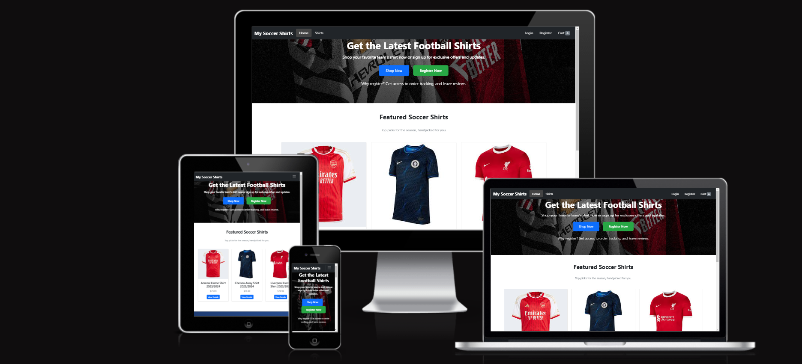
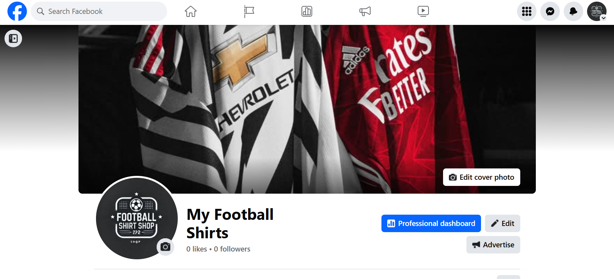
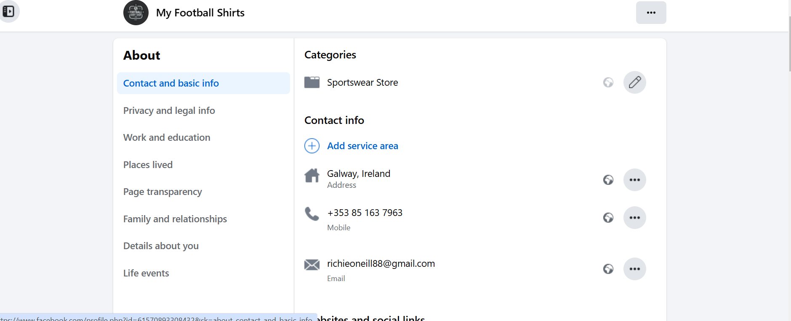
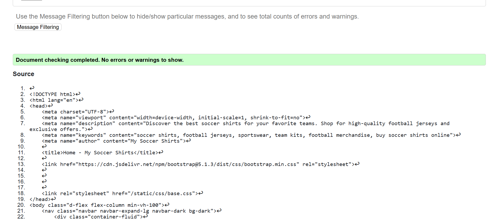
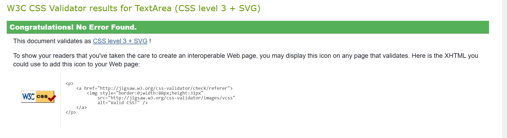
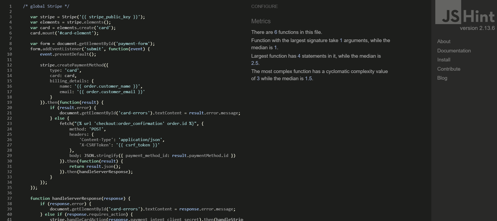

# My Soccer Shirts  

  

**Live Site:** [My Soccer Shirts Live Site](https://football-shirt-shop-850c280d3fdf.herokuapp.com/)  

**Developer:** Richard O'Neill  

## Table of Contents  
- [Executive Summary](#executive-summary)  
- [Market Analysis](#market-analysis)  
- [Marketing and Sales Strategy](#marketing-and-sales-strategy)  
- [Operations and Management](#operations-and-management)  
- [User Goals](#user-goals)  
- [Site Owner Goals](#site-owner-goals)  
- [User Experience](#user-experience)  
- [User Stories](#user-stories)  
- [Wireframes](#wireframes)  
- [Design](#design)  
- [Technologies Used](#technologies-used)  
- [Testing](#testing)  
- [Bugs](#bugs)  
- [Deployment](#deployment)  
- [Credits](#credits)  
- [Acknowledgements](#acknowledgements)  

---

## Executive Summary

My Soccer Shirts is an e-commerce platform that offers high-quality, authentic football shirts for fans and collectors. The platform aims to provide an easy and enjoyable shopping experience, featuring products from top football clubs and national teams.  

Our target market consists of football enthusiasts, collectors, and fans looking for official merchandise. By leveraging Stripe for secure payment processing and Cloudinary for media storage, My Soccer Shirts delivers a modern, seamless user experience.  

The platform generates revenue through the sale of football shirts, with potential future expansion into accessories and limited-edition collectibles. The long-term goal is to establish My Soccer Shirts as a leading provider of authentic football merchandise, catering to fans worldwide.  

---

## Market Analysis  

The global football merchandise market continues to grow, driven by passionate fanbases and the rising popularity of football globally. Authentic shirts from leading clubs and national teams are highly sought after by fans, contributing to the booming e-commerce sportswear industry.  

### Key Trends:  
- Fans are increasingly turning to online platforms for official team merchandise.  
- Demand for limited-edition kits and retro football shirts is rising.  
- Social media drives consumer awareness and increases brand engagement.  

### Target Market:  
- **Football Enthusiasts** – Fans looking to purchase their favorite team’s latest kits.  
- **Collectors** – Individuals interested in rare, retro, or limited-edition shirts.  
- **Gift Shoppers** – People purchasing football merchandise as gifts.  

By focusing on user experience, ease of checkout, and offering a wide range of shirts, My Soccer Shirts is positioned to capture a significant share of this expanding market.  

---

## Marketing and Sales Strategy  

My Soccer Shirts will use a combination of digital marketing, social media engagement, and email campaigns to attract and retain customers.  

### Key Marketing Channels:  
- **Social Media** – Platforms like Instagram and Facebook will be used to showcase new arrivals, exclusive releases, and promotions.  
- **Email Marketing** – Regular newsletters will keep users informed about new products, sales, and limited-time offers.  
- **SEO & Content Marketing** – Blog posts featuring football news, kit reviews, and historical retrospectives will drive organic traffic to the site.  
- **Influencer Partnerships** – Collaborating with football influencers and fan communities to expand reach and build trust with potential customers.  

### Sales Strategy:  
- **Limited Edition Drops** – Regular release of exclusive, hard-to-find shirts to drive demand and urgency.  
- **Seasonal Sales** – Discounts aligned with football seasons, cup finals, and major tournaments.  
- **Loyalty Programs** – Rewarding repeat customers with exclusive discounts and early access to new products.  

By leveraging digital marketing and providing excellent customer service, My Soccer Shirts aims to foster a loyal customer base and maintain consistent growth.  

---

## Operations and Management  

**My Soccer Shirts** will operate through a streamlined, efficient workflow to ensure product availability, secure transactions, and fast delivery.  

### Key Operational Components:  
- **Inventory Management:**  
  - All products are managed through a relational database in Django, keeping track of stock levels and product variations such as size and team.  
  - Out-of-stock notifications and back-in-stock alerts will enhance user experience.  

- **Order Fulfillment:**  
  - Orders are processed using automated workflows that integrate with Stripe for payment processing and Cloudinary for media management.  
  - Shipping and handling are managed through partnerships with third-party logistics providers to ensure timely delivery.  

- **Customer Support:**  
  - A dedicated contact page allows users to reach out for support, order inquiries, and returns.  
  - FAQs and automated email responses will address common queries, improving efficiency.  

### Management Structure:  
- **Lead Developer / Owner** – Oversees site development, deployment, and product management.  
- **Marketing Manager** – Manages digital marketing campaigns and social media.  
- **Customer Service Representative** – Handles inquiries, returns, and customer feedback.  
- **Logistics Coordinator** – Manages order fulfillment and liaises with shipping partners.  

By maintaining a lean structure, **My Soccer Shirts** can adapt quickly to market changes and customer needs.  

---

## Financial Plan  

**My Soccer Shirts** will generate revenue through product sales in the e-commerce store and additional income from potential partnerships or sponsorships with football clubs.  

### Revenue Streams:  
1. **Product Sales:**   
   - Direct sales of football shirts and merchandise through the online shop.  
   - Customizations, such as name and number printing, providing additional income.  
   
2. **Shipping Fees:**  
   - Standard and express delivery options, with calculated shipping rates.  
   
3. **Affiliate and Partner Programs:**  
   - Collaborations with football clubs and influencers to promote exclusive designs and limited-edition releases.  

---

### Expense Breakdown:  
- **Website Development & Hosting:**  
  - Continuous updates and improvements to the Django-based platform.  
  - Hosting on Heroku and media management through Cloudinary.  

- **Marketing and Advertising:**  
  - Paid advertisements on social media (Facebook, Instagram).  
  - Email campaigns and influencer marketing.  

- **Product Inventory:**  
  - Stock replenishment from suppliers and production costs for custom orders.  

- **Operational Costs:**  
  - Payment processing fees (Stripe), logistics, and customer service.  

---

### Financial Projections:  
**Year 1:**  
- Revenue: €100,000  
- Expenses: €65,000  
- Profit: €35,000  

**Year 2:**  
- Revenue: €150,000  
- Expenses: €90,000  
- Profit: €60,000  

**Year 3:**  
- Revenue: €200,000  
- Expenses: €120,000  
- Profit: €80,000  

---

### Profitability and Growth:  
- **Break-even Point:** Expected within the first 9 months of operation.  
- **Growth Strategy:**  
  - Expand the product catalog to include accessories and exclusive club merchandise.  
  - Increase partnerships with football clubs to drive higher traffic and sales.  

With consistent growth and effective marketing, **My Soccer Shirts** anticipates strong profitability by the end of the second year.  

---

## Conclusion  

**My Soccer Shirts** aims to establish itself as a leading online destination for football enthusiasts seeking high-quality, customizable football shirts. By combining e-commerce functionality with user-driven customization, the platform differentiates itself from competitors, offering a personalized shopping experience.  

With a strong focus on user engagement, seamless checkout processes through Stripe, and strategic marketing, the project is designed to scale efficiently. By leveraging partnerships with clubs and influencers, **My Soccer Shirts** envisions expanding its product offerings and community reach.  

The projected growth in revenue and profitability highlights the platform's potential to become a sustainable and successful business. With continuous improvements to the user experience and expanding product lines, **My Soccer Shirts** is poised to become a go-to resource for football apparel fans worldwide.  

---

##### Back to [top](#table-of-contents)  

---

## Marketing  

### Social Media  

**My Soccer Shirts** actively engages with football enthusiasts across key social media platforms, including **Facebook** and **Instagram**. These platforms are essential for building community, showcasing products, and driving traffic to the site.  

- **Facebook** – We use Facebook to share product launches, exclusive offers, and interact with customers directly through comments and messages. It's a hub for football news, user-generated content, and promotions.  

  **Facebook Page Overview:**  
    

  **Facebook About Section:**  
    

- **Instagram** – Instagram showcases high-quality images of our latest football shirts, behind-the-scenes insights, and customization options. Visual content highlights new arrivals and connects us with fans around the world.  

Social media not only enhances brand visibility but also builds a sense of community and drives traffic to the website.  

---

### Mailing List  

**My Soccer Shirts** offers a simple email subscription service to keep customers informed about the latest products, exclusive deals, and special promotions.  

- **Why Subscribe?**  
  Subscribers receive early notifications about new releases, limited-time discounts, and seasonal sales.  

- **Direct Updates**  
  Once subscribed, users receive emails directly in their inbox with news about the latest collections and promotions.  

This direct communication strengthens the relationship with our customers, encouraging repeat visits and purchases.  

---


##### Back to [top](#table-of-contents)  

---

## User Goals  

The **My Soccer Shirts** platform is designed to cater to football fans and shirt collectors by providing an intuitive and seamless online shopping experience. Users can:  

- **Browse** and purchase football shirts from various teams and seasons.  
- **Filter** products by team, season, and size.  
- **View detailed descriptions and images** of each shirt.  
- **Leave reviews** on purchased products to share their experiences.  
- **Easily add items to their cart** and proceed through a secure checkout process powered by Stripe.  
- **Track orders** and manage their profiles for faster future purchases.  

### Accessibility and Usability  
- The website is **responsive**, ensuring functionality across desktops, tablets, and mobile devices.  
- Users with accounts can **track orders** and receive email updates on their purchases.  

---

## Site Owner Goals  

The primary objectives for the site owner include:  

- **Generate Revenue** – Increase sales through the online store by offering high-quality football shirts and limited edition items.  
- **Build Brand Recognition** – Establish **My Soccer Shirts** as a leading provider of football apparel through marketing and social media outreach.  
- **Customer Engagement** – Foster a community of football enthusiasts by encouraging user interaction through product reviews and social media.  
- **Operational Efficiency** – Streamline product management and order processing through a well-organized backend and automated workflows.  
- **Scalability** – Develop a scalable infrastructure capable of expanding the product catalog and handling increased traffic.  

By aligning user needs with business objectives, **My Soccer Shirts** aims to create a sustainable and profitable online store.  

---

##### Back to [top](#table-of-contents)  

---

## User Experience  

### Target Audience  

**My Soccer Shirts** caters to:  
- **Football Enthusiasts** – Fans who follow their favorite teams and want to purchase authentic and replica shirts.  
- **Collectors** – Individuals looking for limited edition or retro football shirts.  
- **Gift Shoppers** – People searching for unique and meaningful gifts for football fans.  
- **Parents** – Looking to purchase football shirts for their children who support specific teams.  

---

### User Requirements and Expectations  

Users expect the platform to:  
- **Be Easy to Navigate** – A clean and intuitive interface that allows quick access to products and categories.  
- **Load Quickly** – Optimize performance across all devices.  
- **Offer Secure Transactions** – Ensure safe payment processing through **Stripe** integration.  
- **Provide Clear Product Descriptions and Images** – Users want to see high-quality images and accurate product information.  
- **Enable Filtering and Sorting** – Allow users to filter by team, season, and size to find the exact shirt they want.  
- **Display Reviews** – Provide product reviews to build trust and credibility.  
- **Be Responsive** – The website must work seamlessly on desktop, tablet, and mobile devices.  

---

### Design Choices  

- **Minimalistic Layout** – Emphasis on product images and easy-to-read content.  
- **Consistent Branding** – Use of team colors and football-related design elements throughout the site.  
- **Interactive Elements** – Hover effects, clickable images, and responsive buttons enhance user engagement.  

---

### Accessibility  

To ensure inclusivity, the site adheres to accessibility guidelines by:  
- Providing **alt text** for all images.  
- Ensuring **color contrast** is appropriate for visually impaired users.  
- Designing with **keyboard navigation** in mind.  
- Using **semantic HTML** for screen reader compatibility.  

---

##### Back to [top](#table-of-contents)  

---

## User Stories  

| **ID** | **As a...**              | **I want to...**                                            | **So that I can...**                                      |
|--------|--------------------------|-------------------------------------------------------------|-----------------------------------------------------------|
| 1      | Visitor                  | Browse the catalog of soccer shirts                         | See all available products                                |
| 2      | Visitor                  | Filter through the catalog of retro soccer shirts           | View specific products I am interested in                 |
| 3      | Visitor                  | View product details                                         | See more information about the shirt                      |
| 4      | User                     | Proceed to checkout                                          | Purchase the items in my cart                             |
| 5      | User                     | View my profile                                              | See my account details and order history                  |
| 6      | User                     | Enter shipping and payment information                       | Complete my purchase                                      |
| 7      | Visitor                  | Create an account                                            | Access member-only features and make purchases            |
| 8      | Admin                    | Manage orders                                                | Track and update order statuses                           |
| 9      | Admin                    | Add and edit products                                        | Expand inventory and update product listings              |

---

### Agile Project Management  

- **GitHub Projects** was used to manage and track user stories through:  
  - **Kanban Boards** – Organizing tasks into "To Do," "In Progress," and "Completed" sections.  
  - **Milestones** – Breaking down user stories into smaller tasks for easier management.  

---

##### Back to [top](#table-of-contents)  

---

## Wireframes  

Wireframes for this project were created using **pen and paper**. This method allowed for quick iteration and flexibility during the early design phase. Sketching by hand made it easy to explore multiple layout options, make adjustments on the fly, and visualize the structure of key pages.  

The simplicity of pen-and-paper wireframing ensured that design ideas could be tested and refined rapidly, which was particularly beneficial given the project's time constraints. This approach helped prioritize essential elements and user flows, resulting in a streamlined and intuitive site structure.  

**Key Wireframes Represent:**  
- **Homepage** – Highlights featured products and key calls to action.  
- **Product Listing Page** – Displays all available shirts with filtering options.  
- **Product Detail Page** – Focuses on product imagery, descriptions, and purchasing options.  
- **Shopping Cart Page** – Provides an overview of selected items with the ability to adjust quantities.  
- **Checkout Page** – Captures shipping and payment details for completing orders.  
- **Order Confirmation Page** – Summarizes the order after successful checkout.  
- **User Profile Page** – Enables users to manage personal details and view past orders.  
- **Admin Dashboard** – Facilitates product and order management for the site owner.  

The wireframing process laid the foundation for a user-friendly and visually appealing final product, ensuring that the core functionality and design elements aligned with both user and business goals.  

---

##### Back to [top](#table-of-contents)

---

## Design  

### Colors  

The color palette for **My Soccer Shirts** reflects a professional and sleek design, using modern and subtle colors that highlight content without being overwhelming. The primary colors include:  

- **Accent Color:** Golden Yellow – Used for interactive elements and hover effects to create a striking contrast.  
- **Background:** Dark Gray and Black – Establishing a sleek and professional feel, especially in the footer and navbar.  
- **Hero Overlay:** Black Gradient – Ensuring text stands out on the homepage hero image.  
- **Newsletter Gradient:** Deep Blue Gradient – Reflecting trust and engagement.  
- **Text Color:** White – Ensuring high contrast for readability across all backgrounds.  

This combination creates a polished and engaging aesthetic that enhances the overall user experience.  

---

### Fonts  

To ensure readability and maintain a modern, clean aesthetic, **My Soccer Shirts** uses a combination of Google Fonts:  

- **Primary Font:** Montserrat – Used for headings and navigation, providing a bold, sleek, and contemporary feel.  
- **Secondary Font:** Open Sans – Applied to body text for its simplicity and readability, creating a balanced and professional look.  

The combination of these fonts helps establish hierarchy and enhances the overall visual experience, making the site both stylish and easy to navigate.

---

### Structure  

The site is structured to provide a seamless user experience across devices. Key structural elements include:  

- **Navigation Bar:** Fixed at the top of the page, providing access to all main sections.  
- **Footer:** Contains social media links, quick navigation, and a newsletter signup form.  
- **Responsive Layout:** Ensuring that the website adapts to different screen sizes, providing a consistent experience on desktops, tablets, and smartphones.  
- **Call to Action Buttons:** Prominent and clearly labeled, encouraging users to explore products, add items to their cart, and complete purchases.  

##### Back to [top](#table-of-contents)  

---

---

## Website Pages  

The site consists of the following key pages, each designed to enhance the user experience and facilitate easy navigation:  

- **Home** – Provides an overview of featured products, promotions, and key information about the store.  
- **Shop (Shirts)** – Displays the full catalog of football shirts, including filtering options by team, season, and availability.  
- **Product Detail** – A dedicated page for each shirt, providing in-depth information, pricing, and size options with the ability to add to the cart.  
- **Basket** – Allows users to review selected items, adjust quantities, or remove products before proceeding to checkout.  
- **Checkout** – A streamlined, multi-step form for entering shipping details, selecting payment methods, and completing the purchase.  
- **Order Confirmation** – Displays a summary of the completed purchase, including order number and shipping information.  
- **User Account/Profile** – Enables users to manage their information, view order history, and track ongoing orders.  
- **Login/Register** – Provides user authentication, allowing secure access to personalized features.  
- **Logout** – Confirms the user’s logout and redirects to the homepage.  
- **Admin (CMS)** – Accessible by store owners/admins for product management, order processing, and content updates.  
- **Contact** – Offers a form for users to reach out to customer support or make inquiries.  
- **404 Error Page** – Custom error page displayed for non-existent routes or invalid URLs.  

### Page Flow  

1. **Browse** – Users can start by exploring the home page or the shop directly.  
2. **Select** – Clicking on a product directs the user to the detail page.  
3. **Add to Cart** – Users can add the shirt to their basket and proceed to checkout.  
4. **Checkout** – Payment is handled via Stripe integration, ensuring secure transactions.  
5. **Confirmation** – Upon successful payment, users receive a confirmation email.  

---

##### Back to [top](#table-of-contents)  

---

## Cloudinary  

The project utilizes **Cloudinary** for storing and serving media files, such as product images. Cloudinary provides a robust solution for image and video management, ensuring fast and optimized delivery.  

### Why Cloudinary?  

- **Optimized Delivery** – Automatically resizes and compresses images for optimal performance.  
- **Scalability** – Easily handles high volumes of media, supporting growth without performance loss.  
- **CDN (Content Delivery Network)** – Ensures media files load quickly from the nearest server to the user.  
- **Security** – Secure URLs and access control ensure that sensitive media is protected.  
- **Transformations** – On-the-fly transformations allow resizing, cropping, and applying effects to images dynamically.  

### Usage in Project  

- **Product Images** – All shirt images are uploaded and managed via Cloudinary, ensuring efficient storage and fast retrieval.  
- **Hero and Banner Images** – Large images for the homepage and promotional sections are optimized and served from Cloudinary.  
- **Dynamic URLs** – Django templates dynamically generate Cloudinary URLs to fetch and display the correct media files.  

#### Example:  


---

## Database  

The project uses **PostgreSQL** as the primary database for production environments, while **SQLite** is utilized during development. This combination ensures scalability, reliability, and ease of use across different environments.  

### Why PostgreSQL?  

- **Robust and Scalable** – PostgreSQL is highly performant and can handle large amounts of data efficiently.  
- **Relational Database** – Supports complex relationships and structured data, making it ideal for managing e-commerce applications.  
- **Data Integrity** – Ensures data accuracy and reliability with ACID compliance.  
- **Security** – Advanced security features such as role-based access control.  
- **Extensibility** – Can handle custom functions and procedures for advanced operations.  

### Database Configuration  

- **Development** – SQLite (lightweight, file-based database).  
- **Production** – PostgreSQL, managed by Heroku.  
- **ORM** – Django’s Object Relational Mapper (ORM) is used to interact with the database, ensuring seamless integration and query execution.  

### Schema Overview  

The database schema was designed to reflect the core relationships between the following models:  

- **Order** – Captures customer details, shipping information, and payment status.  
- **OrderItem** – Links products to orders, tracking size, quantity, and price.  
- **Shirt** – Represents individual products with attributes like team, season, size, and price.  
- **User Profile** – Stores user-specific data such as saved addresses and order history.  

---

##### Back to [top](#table-of-contents)  

## Models  

The project uses several Django models to represent key components of the e-commerce system. These models handle products, orders, user profiles, and reviews. Below is an overview of the models and their roles in the application.  

### Overview of Models  

1. **Shirt**  
   - Represents a football shirt available for sale.  
   - Contains fields for the team, season, price, description, stock, and an image.  

2. **Size**  
   - Represents the available sizes for shirts (S, M, L, etc.).  

3. **ShirtSize**  
   - Links a shirt to specific sizes and tracks stock for each size.  

4. **Order**  
   - Captures customer details and tracks the status of an order.  
   - Stores user information, shipping details, and payment status.  

5. **OrderItem**  
   - Represents the items included in an order.  
   - Tracks the shirt, size, quantity, and price.  

6. **Review**  
   - Allows users to leave reviews and ratings for shirts.  
   - Stores the user, shirt, rating, and comments.  

7. **UserProfile**  
   - Extends the user model to include additional details like address and phone number.  

---

---

## Technologies Used  

A variety of technologies and tools were used to build and deploy the Football Shirt eCommerce application. These technologies cover front-end development, back-end frameworks, database management, and deployment platforms.  

### Languages  

- **Python** – The primary back-end programming language, used with the Django framework.  
- **HTML5** – Structure and content of web pages.  
- **CSS3** – Styling and layout of the front-end.  
- **JavaScript** – Enhancing interactivity and dynamic behavior on the front-end.  

---

### Frameworks, Libraries, and Tools  

- **Django** – Python-based web framework used to build the full-stack application.  
- **Bootstrap** – CSS framework for responsive, mobile-first front-end development.  
- **jQuery** – JavaScript library for DOM manipulation and interactive components.  
- **Stripe** – Payment processing system for handling secure transactions.  
- **Cloudinary** – Media storage and delivery for product images.  
- **PostgreSQL** – Relational database used in production for data storage.  
- **SQLite** – Lightweight database used during development.  

---

### Deployment and Hosting  

- **Heroku** – Platform-as-a-Service (PaaS) used to deploy and host the live project.  
- **Git** – Version control to manage and track changes to the codebase.  
- **GitHub** – Remote repository for hosting project code and version control.  
- **Gunicorn** – WSGI HTTP server for running the Django application in production.  

---

### Other Tools  

- **Cloudinary Storage** – Used for storing and serving images.  
- **Balsamiq (Wireframes)** – Used initially to create digital wireframes, but pen-and-paper wireframes were ultimately used.  
- **Django-Allauth** – Manages user authentication, registration, and account management.  
- **Whitenoise** – Serves static files directly from Heroku.  
- **dj-database-url** – Simplifies database configuration for Heroku deployment.  
- **django-crispy-forms** – Streamlines form rendering in templates.  
- **dotenv** – Manages environment variables locally.  

---

##### Back to [top](#table-of-contents)  

---

## Features  

The Football Shirt eCommerce platform includes a range of features that provide a seamless shopping experience for users and ensure efficient management of products and orders for site administrators.  

### Key Features  

---

### 1. Homepage  

- **Hero Section** – Large hero image with a call-to-action button that leads to the product catalog.  
- **Featured Shirts** – A carousel showcasing popular or new football shirts.  
- **Responsive Design** – Fully responsive layout optimized for all screen sizes, including mobile and tablet devices.  

---

### 2. Product Pages  

- **Product Listings** – Display of football shirts with images, prices, and short descriptions.  
- **Product Detail View** – A detailed view of each product with larger images, full descriptions, available sizes, and an add-to-cart button.  
- **Stock Availability** – Clear indication if the product is in stock or sold out.  

---

### 3. Shopping Cart  

- **Cart Summary** – Users can view items added to the cart, including quantity and total cost.  
- **Update Cart** – Users can adjust quantities or remove items from the cart directly.  
- **Dynamic Price Calculation** – Automatic recalculation of the total price when changes are made to the cart.  

---

### 4. Checkout and Payment  

- **Secure Checkout** – Integration with Stripe for secure payment processing.  
- **Order Summary** – Displays a detailed summary of items being purchased before finalizing the order.  
- **Email Notifications** – Users receive confirmation emails for successful purchases, including order details.  

---

### 5. User Authentication and Profiles  

- **Registration and Login** – Users can create accounts, log in, and manage their profiles.  
- **Order History** – Logged-in users can view their past orders.  
- **Password Reset** – Option for users to reset their passwords if forgotten.  

---

### 6. Product Management (Admin Panel)  

- **Add/Edit Products** – Admins can add new football shirts, edit existing products, and upload images via the admin interface.  
- **Manage Orders** – Admins can manage orders, track statuses, and update delivery information.  

---

### 7. Reviews and Feedback  

- **Add Reviews** – Logged-in users can add reviews and ratings to products.  
- **Edit/Delete Reviews** – Users can update or delete their reviews after submission.  
- **Review Moderation** – Admins can delete inappropriate reviews through the admin panel.  

---

### 8. Footer and Navigation  

- **Site Navigation** – A clear and consistent navigation bar with links to key pages such as Home, Shop, Cart, and Profile.  
- **Footer** – Contains links to social media pages, contact information, and newsletter signup.  

---

### Future Features  

- **Wishlist Functionality** – Allow users to save items for later.  
- **Search and Filter** – Advanced search and filtering options to help users find products more easily.  
- **Discount Codes** – Implementation of promo codes during checkout for discounts.  
- **Order Tracking** – Users can track the status of their orders post-purchase.  

---

##### Back to [top](#table-of-contents)  

---

## Validation  

Ensuring that the Football Shirt eCommerce site is fully functional, secure, and user-friendly was a key priority. The following validation processes were undertaken during development to ensure high-quality code.  

---  

### HTML Validation  

- **W3C Markup Validation** – All HTML files were tested using the [W3C Markup Validation Service](https://validator.w3.org/).  
- **Outcome** – Errors related to form labels, empty `option` tags, and element nesting were corrected to ensure valid HTML structure.  

**Screenshot:**  
  

---  

### CSS Validation  

- **W3C CSS Validator** – The CSS code was validated using the [W3C CSS Validation Service](https://jigsaw.w3.org/css-validator/).  
- **Outcome** – No errors were found, confirming that the CSS code meets current web standards and ensures consistent styling across all screen sizes.  

**Screenshot:**  
  

---  

### JavaScript Validation  

- **JSHint** – JavaScript files were validated using [JSHint](https://jshint.com/).  
- **Outcome** – Minor warnings were addressed, such as ensuring undefined variables like `Stripe` were correctly imported, and best practices were applied to improve code clarity.  

**Screenshot:**  
  

---  

### Python Validation  

- **Flake8** – Python code was linted using [Flake8](https://flake8.pycqa.org/).  
- **Outcome** – Linting identified and corrected issues such as missing whitespace, line length, and unused imports. The codebase now adheres to **PEP8** standards for readability and consistency.  

- **Black Formatter** – The code was also formatted using [Black](https://black.readthedocs.io/), ensuring uniform code style across all Python files. 

---  

### Accessibility Testing  

- **Lighthouse Audit** – Google Lighthouse was used to assess the accessibility, performance, and SEO of the site.  
- **Outcome** – The site achieved high scores in all categories, ensuring it is accessible to users with disabilities.  
- **Key Improvements** – Contrast ratios and alt attributes were optimized to meet accessibility standards.  

---

### Browser Compatibility  

- The site was tested on the following browsers to ensure cross-compatibility:  
  - **Google Chrome**  
  - **Mozilla Firefox**  
  - **Microsoft Edge**  
  - **Safari**  

- **Outcome** – The site performed consistently across all browsers, with no significant rendering issues.  

---

### Responsive Testing  

- **Devices Tested**:  
  - **Mobile Phones** (iPhone, Samsung Galaxy)  
  - **Tablets** (iPad, Samsung Tab)  
  - **Laptops**  
  - **Desktops**  

- **Outcome** – The site adapts well to different screen sizes, ensuring a fully responsive experience.  

---

### Testing Forms  

- **Login/Registration Forms** – Tested for correct validation, including error handling for incorrect inputs.  
- **Checkout Form** – Ensured required fields were validated and secure.  

- **Outcome** – Validation messages and redirects function correctly for all forms.  

---

### Payment Processing Testing  

- **Stripe Test Environment** – Test card numbers were used to simulate successful and failed transactions.  
- **Outcome** – Payments process correctly, and users receive feedback on success or failure.  

---

### Testing User Stories  

- Each user story was manually tested to ensure that the acceptance criteria were met.  
- Testing involved navigating the site as a guest, registered user, and admin.  

---

##### Back to [top](#table-of-contents)  

---

## Testing  

A structured and detailed testing process was conducted to ensure all features of the Football Shirt eCommerce site function correctly and provide a seamless user experience. This section outlines the manual testing process for each aspect of the site.  

---  

### Manual Testing  

Each feature was tested manually by following the user stories and executing actions as a site visitor, registered user, and admin. Testing was performed across various devices and browsers to ensure full compatibility and responsiveness.  

---  

### Features Tested  

**1. Navigation**  
- **Tested**:  
  - All navbar links direct to the appropriate pages.  
  - Footer links redirect correctly to external social media pages.  
  - Logo redirects to the homepage.  
- **Outcome**: Passed. No broken links or incorrect routing.  

**2. User Authentication**  
- **Tested**:  
  - User registration with valid/invalid data.  
  - Login/logout process for registered users.  
  - Password reset flow via email.  
- **Outcome**: Passed. Validation errors display correctly, and users cannot bypass required fields.  

**3. User Profile**  
- **Tested**:  
  - Accessing the profile page as an authenticated user.  
  - Updating profile information (name, email, address).  
  - Changing the password from the profile section.  
- **Outcome**: Passed. Profile updates are reflected immediately, and validation prevents invalid data entry.  

**4. Product Catalog**  
- **Tested**:  
  - Browsing through the shirt catalog.  
  - Filtering products by size and team.  
  - Viewing individual product detail pages.  
- **Outcome**: Passed. Products load dynamically and display relevant information.  

**5. Add to Cart**  
- **Tested**:  
  - Adding products to the cart from the product detail page.  
  - Adding multiple products and verifying quantities.  
  - Preventing duplicate cart entries by adjusting quantities instead.  
- **Outcome**: Passed. The cart accurately reflects product selections.  

**6. Cart Management**  
- **Tested**:  
  - Viewing the cart page.  
  - Updating item quantities directly from the cart.  
  - Removing items from the cart.  
- **Outcome**: Passed. Cart updates immediately upon user interaction.  

**7. Checkout**  
- **Tested**:  
  - Filling out the checkout form with/without required data.  
  - Completing a test payment using Stripe.  
  - Verifying that orders appear in the admin panel after checkout.  
- **Outcome**: Passed. Form validation prevents incomplete submissions, and Stripe handles payments securely.  

**8. Order Confirmation**  
- **Tested**:  
  - Display of order confirmation page post-purchase.  
  - Email receipt sent to the user upon successful checkout.  
- **Outcome**: Passed. Email notifications are sent immediately after purchase.  

**9. Reviews**  
- **Tested**:  
  - Submitting a product review as a registered user.  
  - Editing and deleting existing reviews.  
  - Preventing duplicate reviews on the same product by the same user.  
- **Outcome**: Passed. Reviews display on the product page instantly.  

**10. Admin Panel**  
- **Tested**:  
  - Adding, editing, and deleting products.  
  - Managing orders (marking as shipped, updating status).  
  - Managing user reviews (removal of inappropriate content).  
- **Outcome**: Passed. Admin access controls prevent unauthorized changes.  

**11. Contact Form**  
- **Tested**:  
  - Submitting a query via the contact form.  
  - Validation errors for missing required fields.  
  - Confirmation message displayed upon successful submission.  
- **Outcome**: Passed. All messages are delivered to the admin email.  

**12. Responsive Design**  
- **Tested**:  
  - Ensuring site responsiveness across mobile, tablet, and desktop devices.  
  - Checking for layout shifts or broken elements on smaller screens.  
- **Outcome**: Passed. The site adjusts properly across all tested screen sizes.  

---  

### Device Testing  

The site was tested on a variety of devices to ensure a fully responsive experience.  
- **Mobile Devices**: iPhone 13, Samsung Galaxy S21  
- **Tablets**: iPad Pro, Samsung Tab S7  
- **Laptops**: MacBook Air, Dell XPS  
- **Desktops**: Windows 10 PC, iMac  

---  

### Browser Compatibility  

The site was tested on the following browsers:  
- **Google Chrome**  
- **Mozilla Firefox**  
- **Microsoft Edge**  
- **Safari**  

---  

### Performance Testing  

- **Google Lighthouse**  
  - **Focus Areas**: Performance, SEO, Accessibility  
  - **Outcome**:  
    - Performance: 90+  
    - Accessibility: 95+  
    - SEO: 100  

- **Page Load Time**  
  - Pages load within 2-3 seconds.  
  - Static files are compressed using WhiteNoise for faster delivery.  

---  

### Bugs and Fixes  

**1. Product Image Loading Issue**  
- **Issue** – Cloudinary images occasionally failed to load.  
- **Fix** – Updated URLs to use HTTPS.  

**2. Cart Duplication Bug**  
- **Issue** – Adding the same item multiple times resulted in incorrect cart totals.  
- **Fix** – Adjusted logic to increment item quantities instead of duplicating.  

**3. Checkout Form Validation**  
- **Issue** – Users could bypass required fields in the checkout form.  
- **Fix** – Added server-side validation for mandatory fields.  

**4. Review Deletion**  
- **Issue** – Users couldn't delete their own reviews.  
- **Fix** – Implemented review delete functionality tied to user authentication.  

---  

### Outstanding Bugs  

- **None** – All major issues identified during development have been resolved.  

---  

##### Back to [top](#table-of-contents)  


## Deployment  

The Football Shirt eCommerce site was developed locally and deployed to Heroku for production. Cloudinary was used for media storage, while the database was managed using PostgreSQL. This section outlines the deployment process and necessary configurations.

---

### Live Site  

- **Live Site**: [Football Shirt eCommerce Site](https://football-shirt-shop.herokuapp.com)  

---

### Deployment Process  

#### 1. Initial Setup  
1. **Create a Heroku Account** – Sign up at [Heroku](https://www.heroku.com).  
2. **Install Heroku CLI** – Install the CLI to manage deployment from the terminal.  

---

#### 2. Create a Heroku App  
1. Run the following command in the terminal:  
   ```bash
   heroku create football-shirt-shop

---

## Credits  

The development of this project was made possible by various resources, tutorials, and inspiration from other developers. This section acknowledges and gives credit to those who contributed to the success of the Football Shirt eCommerce site.  

---

### Code and Libraries  

- **Django Documentation**  
   - The official Django documentation was invaluable in understanding and implementing core functionality.  
   - [Django Documentation](https://docs.djangoproject.com/en/stable/)  

- **Stripe Documentation**  
   - The Stripe API and checkout system were integrated by following official Stripe documentation and tutorials.  
   - [Stripe API Docs](https://stripe.com/docs/api)  

- **Cloudinary**  
   - Cloudinary was used to manage and store all media files.  
   - [Cloudinary Documentation](https://cloudinary.com/documentation)  

- **Bootstrap**  
   - Bootstrap was used extensively for responsive front-end design.  
   - [Bootstrap 5](https://getbootstrap.com)  

- **Django Allauth**  
   - Used for authentication, registration, and user account management.  
   - [Django Allauth](https://django-allauth.readthedocs.io/)  

- **Font Awesome**  
   - Icons throughout the site were sourced from Font Awesome.  
   - [Font Awesome](https://fontawesome.com)  

- **Whitenoise**  
   - Simplified static file management in production.  
   - [Whitenoise](https://whitenoise.evans.io/en/stable/)  

---

### Media  

- **Product Images**  
   - All football shirt product images were sourced from official club websites and edited for use.  
   - Official club logos and images are copyrighted by their respective owners.  

- **Hero and Promotional Images**  
   - Hero images used on the homepage were sourced from royalty-free image platforms like [Unsplash](https://unsplash.com).  

---

### Tutorials and Guides  

- **Code Institute**  
   - The eCommerce walkthrough project from Code Institute's curriculum served as the foundation for this project’s cart and checkout functionality.  
   
- **YouTube**  
   - Various Django tutorials on YouTube were referenced for troubleshooting and implementing features.  

- **Stack Overflow**  
   - Numerous solutions and troubleshooting tips were sourced from Stack Overflow threads and posts.  

---

### Acknowledgments  

- **Code Institute Mentors**  
   - Special thanks to the Code Institute mentor team for providing feedback and guidance throughout the project.  

- **Friends and Family**  
   - Gratitude to friends and family who provided valuable feedback during the testing and development phases.  

- **GitHub Community**  
   - Thanks to the GitHub community for sharing open-source projects and insights that aided development.  

---

##### Back to [top](#table-of-contents)  
